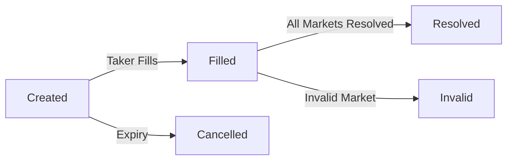

# ParlayMarket 🎯

A decentralized marketplace for fully collateralized parlay markets on **Flare Network**.

## Overview

ParlayMarket allows users to:
- **Create** fully collateralized parlay markets referencing multiple Polymarket markets
- **Trade** parlay positions as ERC-721 tokens
- **Settle** trust-minimized using Polymarket's UMA-based resolutions

### Key Features

✅ **Fully Collateralized** - Both maker and taker deposit collateral upfront  
✅ **Multi-Market Parlays** - Combine multiple Polymarket outcomes into one bet  
✅ **Tradable Positions** - YES/NO positions are ERC-721 NFTs  
✅ **Trust-Minimized Settlement** - Uses Polymarket's UMA oracle for resolution  
✅ **Maker Controls Pricing** - Flexible stake ratios and odds  
✅ **Cancellable** - Unfilled parlays can be cancelled after expiry  

## Tech Stack

### Smart Contracts
- **Solidity 0.8.20**
- **ParlayMarket** - Main contract managing parlay lifecycle
- **ParlayToken** - ERC-721 for tradable positions
- **MockPolymarketOracle** - Test oracle (replace with real Flare Data Connector)

### Frontend
- **Next.js 16** (App Router)
- **React 19**
- **TypeScript**
- **Tailwind CSS 4**
- **Ethers.js v6**

## Getting Started

### Prerequisites

- Node.js 18+ and npm/pnpm
- MetaMask browser extension
- Flare testnet (Coston2) tokens from [faucet](https://faucet.flare.network/coston2)

### Installation

```bash
# Clone the repository
git clone <your-repo-url>
cd parlaymarket

# Install dependencies
npm install
# or
pnpm install

# Run development server
npm run dev
```

Open [http://localhost:3000](http://localhost:3000) to see the app.

## Smart Contract Deployment

See [scripts/deploy.md](scripts/deploy.md) for detailed deployment instructions.

**Quick Deploy with Hardhat:**

```bash
# Install Hardhat
npm install --save-dev hardhat @nomicfoundation/hardhat-toolbox

# Set your private key
echo "PRIVATE_KEY=your_key_here" > .env

# Deploy to Coston2 testnet
npx hardhat run scripts/deploy.ts --network coston2
```

After deployment, update contract addresses in `lib/contracts.ts`.

## Project Structure

```
parlaymarket/
├── app/                      # Next.js pages
│   ├── page.tsx             # Home page
│   ├── create/              # Create parlay page
│   ├── browse/              # Browse all parlays
│   ├── parlay/[id]/         # Individual parlay details
│   └── my-parlays/          # User's parlays
├── components/              # React components
│   ├── Navigation.tsx       # Top navigation bar
│   ├── WalletConnect.tsx    # Wallet connection button
│   ├── ParlayCard.tsx       # Parlay card display
│   └── LoadingSpinner.tsx   # Loading indicator
├── contracts/               # Solidity smart contracts
│   ├── ParlayMarket.sol     # Main parlay contract
│   ├── ParlayToken.sol      # ERC-721 position tokens
│   ├── MockPolymarketOracle.sol  # Test oracle
│   └── interfaces/          # Contract interfaces
├── hooks/                   # React hooks
│   ├── useWeb3.ts          # Web3 connection hook
│   └── useParlays.ts       # Parlay data fetching
├── lib/                    # Utilities
│   ├── contracts.ts        # Contract addresses & ABIs
│   └── web3.ts            # Web3 helper functions
└── scripts/               # Deployment scripts
    └── deploy.md          # Deployment guide
```

## Usage

### 1. Connect Wallet

Click "Connect Wallet" and approve the connection. The app will prompt you to switch to Flare Coston2 testnet.

### 2. Create a Parlay

1. Navigate to **Create Parlay**
2. Add market legs with UMA IDs (from Polymarket)
3. Set required outcomes for each market (YES/NO)
4. Define your stake and taker's stake
5. Choose your position (YES = all must match, NO = at least one fails)
6. Set expiry time
7. Submit transaction

### 3. Browse & Fill Parlays

1. Go to **Browse Parlays**
2. Click on any open parlay to view details
3. Click **Fill Parlay** to take the opposite side
4. Deposit the required taker stake

### 4. View Your Parlays

Navigate to **My Parlays** to see all parlays you've created or filled.

### 5. Settlement

Once all underlying Polymarket markets are resolved:
1. Go to the parlay detail page
2. Click **Resolve Parlay**
3. Winner receives the total pot (maker stake + taker stake)

## Contract Lifecycle



**States:**
- **Created** - Maker deposited, waiting for taker
- **Filled** - Both sides funded, tokens minted
- **Resolved** - Settled, winner paid out
- **Cancelled** - Unfilled after expiry, stake returned
- **Invalid** - One or more markets resolved as invalid, both sides refunded

## Development

### Adding Features

The codebase is modular and easy to extend:

- **Add new oracle sources**: Implement `IPolymarketOracle` interface
- **Add trading features**: Extend `ParlayToken` with marketplace logic
- **Add filters/search**: Enhance `browse/page.tsx` with filters
- **Add analytics**: Create dashboard pages with stats

### Testing Smart Contracts

```bash
# With Hardhat
npx hardhat test

# With Foundry
forge test
```

### Mock Oracle for Testing

On testnet, use `MockPolymarketOracle` to manually set outcomes:

```javascript
const oracle = new ethers.Contract(ORACLE_ADDRESS, ABI, signer);
await oracle.setOutcome(umaId, 1); // 1 = YES, 0 = NO, 2 = INVALID
```

## Security Considerations

⚠️ **This is a v1 implementation for demonstration purposes.**

Before mainnet deployment:
- [ ] Security audit by reputable firm
- [ ] Add comprehensive test suite
- [ ] Implement pause mechanism
- [ ] Add access control for admin functions
- [ ] Gas optimization
- [ ] Replace MockOracle with real Flare Data Connector
- [ ] Add slippage protection
- [ ] Implement proper error handling

## Roadmap

### v1 (Current)
- ✅ Basic parlay creation and filling
- ✅ ERC-721 position tokens
- ✅ Simple resolution via oracle
- ✅ Cancellation mechanism

### v2 (Future)
- [ ] Order book for secondary trading
- [ ] Partial fills (split positions)
- [ ] Dynamic odds adjustment
- [ ] Batch parlay creation
- [ ] Advanced filtering and search
- [ ] Real-time price feeds
- [ ] Mobile responsive improvements

### v3 (Future)
- [ ] Cross-chain support
- [ ] Liquidity pools
- [ ] Automated market makers for parlays
- [ ] Social features (following, leaderboards)
- [ ] Analytics dashboard

## Contributing

Contributions are welcome! Please:
1. Fork the repository
2. Create a feature branch
3. Make your changes
4. Add tests
5. Submit a pull request

## License

MIT License - see [LICENSE](LICENSE) file

## Resources

- **Flare Network**: https://flare.network/
- **Flare Docs**: https://docs.flare.network/
- **UMA Protocol**: https://docs.umaproject.org/
- **Polymarket**: https://polymarket.com/
- **Next.js**: https://nextjs.org/docs

## Support

For questions or issues:
- Open a GitHub issue
- Join our Discord (coming soon)
- Check documentation in `/docs` (coming soon)

---

Built with ❤️ on Flare Network
