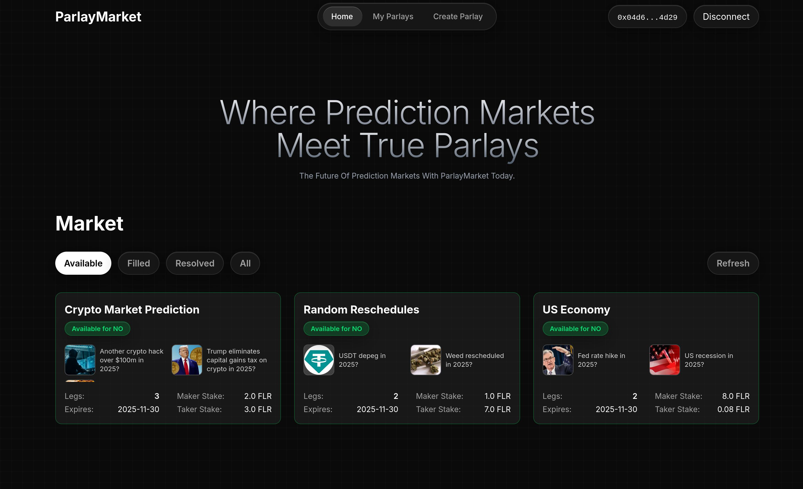
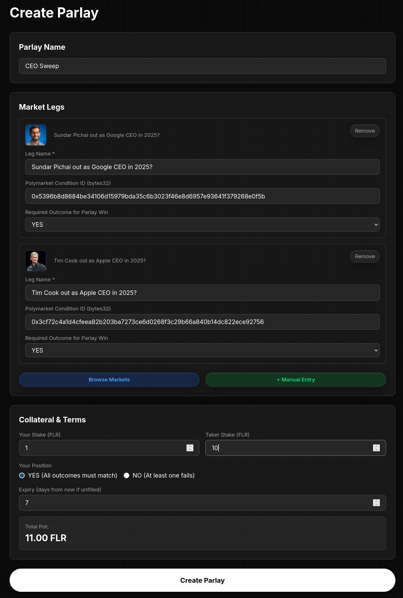
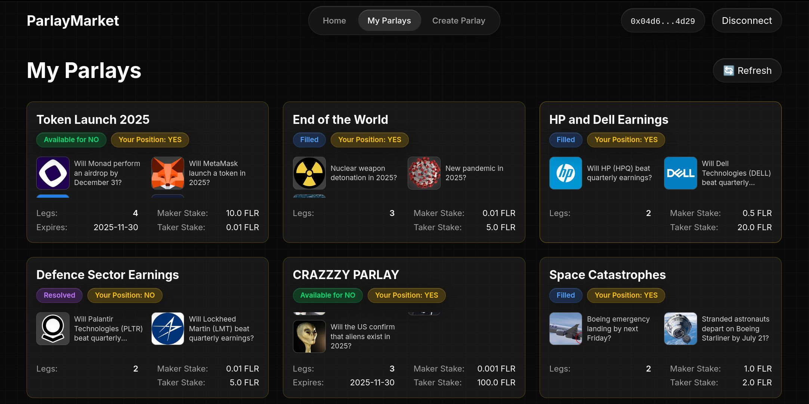
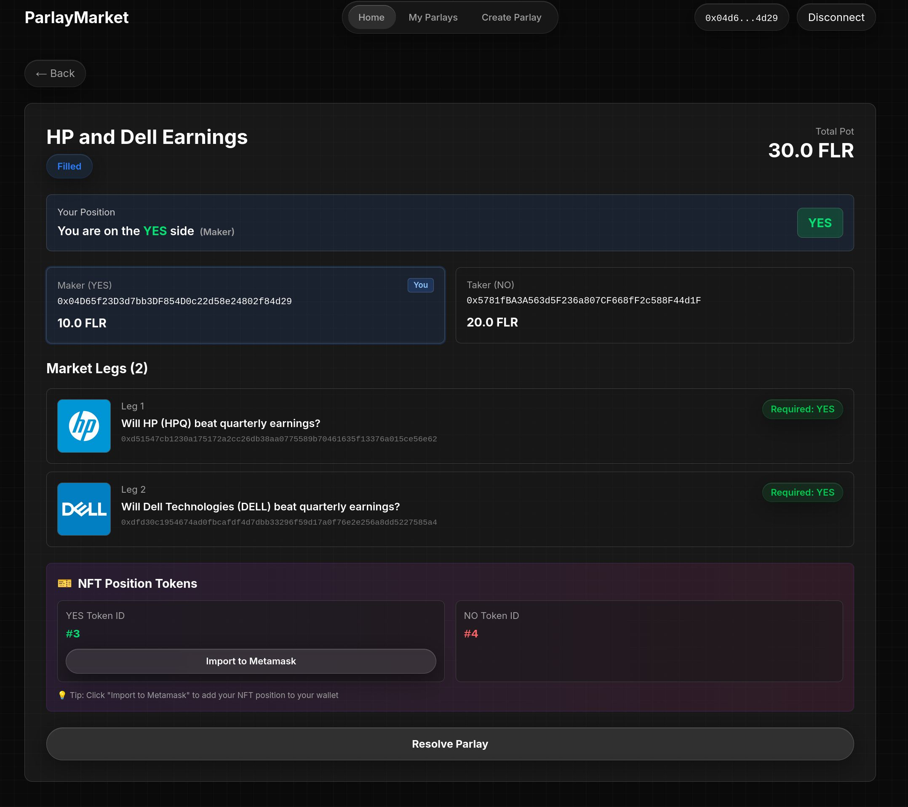
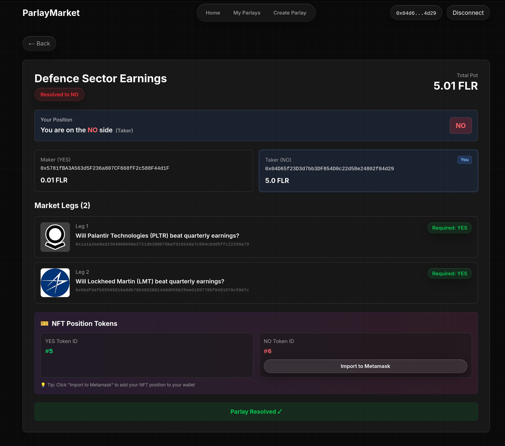
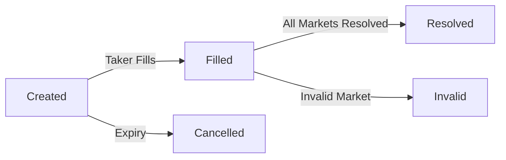

# ParlayMarket

A Flare-based, trust-minimized platform for creating and settling multi-leg parlays using a state channels hub-and-spoke model.

## Demo

https://github.com/user-attachments/assets/018d893a-ad63-44b4-907f-8f2d03bea359

## Screenshots

### Home Page


### Create Parlay


### Parlay Inventory


### Filled Parlay


### Resolved Parlay


---

## Overview

ParlayMarket allows users to create and settle parlays on blockchain-based outcome markets with instant, low-cost collateralization. It leverages a hybrid smart contract and state channel design for rapid, off-chain interaction and final on-chain settlement.

---

## Features

- Multi-leg parlays with ERC-721 tokens representing each position (YES/NO)
- Trust-minimized oracle resolution (UMA, Flare Data Connector)
- Maker determines odds and stake ratios
- Fast and cancellable orders before filling
- Fully non-custodial
- Modular smart contract design
- Comprehensive test scenarios and step-by-step deployment guides

---

## Tech Stack

### Smart Contracts
- **Solidity 0.8.20**
- **ParlayMarket** - Main contract managing parlay lifecycle
- **ParlayToken** - ERC-721 for tradable positions
- **FlarePolymarketOracle** - Oracle using Flare Data Connector (FDC)

---

## Getting Started

### Prerequisites

- Node.js >= 18
- MetaMask
- Flare Coston2 testnet tokens ([faucet link](https://faucet.flare.network/coston2))

### Installation

```bash
git clone <your-repo-url>
git checkout dev2
npm install    # or pnpm install
npm run dev
```
Visit `http://localhost:3000`.

---

## Deployment

- See `/scripts/deploy.md` or `DEPLOYMENT.md` for contract deployment instructions using Hardhat.
- Set deployed contract addresses in `lib/contracts.ts`.
- Quick deploy:
  ```bash
  npx hardhat run scripts/deploy.ts --network coston2
  ```

---

## Project Structure

```
parlaymarket/
├── app/                      # Next.js pages
│   ├── page.tsx             # Home page
│   ├── create/              # Create parlay page
│   ├── browse/              # Browse all parlays
│   ├── parlay/[id]/         # Individual parlay details
│   └── my-parlays/          # User's parlays
├── components/              # React components
│   ├── Navigation.tsx       # Top navigation bar
│   ├── WalletConnect.tsx    # Wallet connection button
│   ├── ParlayCard.tsx       # Parlay card display
│   └── LoadingSpinner.tsx   # Loading indicator
├── contracts/               # Solidity smart contracts
│   ├── ParlayMarket.sol     # Main parlay contract
│   ├── ParlayToken.sol      # ERC-721 position tokens
│   ├── FlarePolymarketOracle.sol  # FDC-integrated oracle
│   └── interfaces/          # Contract interfaces
├── hooks/                   # React hooks
│   ├── useWeb3.ts          # Web3 connection hook
│   └── useParlays.ts       # Parlay data fetching
├── lib/                    # Utilities
│   ├── contracts.ts        # Contract addresses & ABIs
│   └── web3.ts            # Web3 helper functions
└── scripts/               # Deployment scripts
    └── deploy.md          # Deployment guide
```

## Contract Lifecycle


```mermaid
graph LR
    A[Created] -->|Taker Fills| B[Filled]
    A -->|Expiry| C[Cancelled]
    B -->|All Markets Resolved| D[Resolved]
    B -->|Invalid Market| E[Invalid]
```

**States:**
- **Created** - Maker deposited, waiting for taker
- **Filled** - Both sides funded, tokens minted
- **Resolved** - Settled, winner paid out
- **Cancelled** - Unfilled after expiry, stake returned
- **Invalid** - One or more markets resolved as invalid, both sides refunded

## Development

### Adding Features

The codebase is modular and easy to extend:

- **Add new oracle sources**: Implement `IPolymarketOracle` interface
- **Add filters/search**: Enhance `browse/page.tsx` with filters
- **Add analytics**: Create dashboard pages with stats

### Testing Smart Contracts

```bash
# With Hardhat
npx hardhat test

# With Foundry
forge test
```

### Flare Data Connector Integration

**FlarePolymarketOracle** integrates with Flare's Data Connector (FDC) to fetch and verify Polymarket UMA resolution data on-chain.

#### Production Usage (with FDC)

```javascript
const oracle = new ethers.Contract(ORACLE_ADDRESS, ABI, signer);

// Submit outcome with FDC attestation
await oracle.submitOutcome(
  umaId,              // Polymarket UMA question ID
  outcome,            // 0=NO, 1=YES, 2=INVALID
  attestationData,    // FDC attestation data
  merkleProof         // Merkle proof for verification
);
```

#### Testing Mode (Direct Setting)

For testing without FDC attestation, the oracle owner can set outcomes directly:

```javascript
const oracle = new ethers.Contract(ORACLE_ADDRESS, ABI, signer);

// Direct outcome setting (owner only)
await oracle.setOutcomeDirect(umaId, 1); // 1 = YES, 0 = NO, 2 = INVALID

// Batch setting
await oracle.setOutcomesBatch([umaId1, umaId2], [1, 0]);
```

#### FDC Attestation Workflow

1. **Submit Attestation Request** to FDC Hub for Polymarket UMA data
2. **Wait for Finalization** (typically ~90 seconds on Coston2)
3. **Retrieve Attestation Data** from Data Availability Layer
4. **Submit to Oracle** with proof using `submitOutcome()`
5. **Oracle Verifies** proof via FDC Verification contract
6. **Outcome Stored** and available for parlay resolution

For detailed FDC integration guide, see [Flare FDC Documentation](https://dev.flare.network/fdc/overview).

## License

MIT License - see [LICENSE](LICENSE) file

## Resources

- **Flare Network**: https://flare.network/
- **Flare Docs**: https://docs.flare.network/
- **UMA Protocol**: https://docs.umaproject.org/
- **Polymarket**: https://polymarket.com/
- **Next.js**: https://nextjs.org/docs
---

## Usage

1. **Connect your wallet** and switch to the Flare Coston2 network when prompted.
2. **Create a parlay** with custom markets and stakes.
3. **Fill a parlay** (as a taker).
4. **Settle** when the oracle resolves the referenced events.
5. Position tokens are fully tradable until settlement.
